import { Step, Steps } from 'fumadocs-ui/components/steps';
import { Accordion, Accordions } from 'fumadocs-ui/components/accordion';
import { Book, Users, Code, Lightbulb, Target, Handshake, PlusCircle, Edit, CheckSquare, Bug, Image, PenTool} from 'lucide-react';
import { Card, Cards } from '@/components/card';

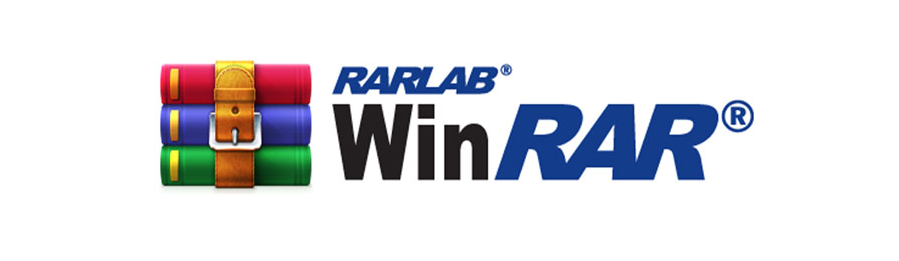

### Creating Portable EXE Files with Winrar
### Introduction 
What is an SFX ? 
<Callout type="info">
  An SFX (Self-extracting) is an archive, merged with an executable module, which is used to extract files from the archive when executed. So no external program is necessary to extract the contents of an SFX archive, it is enough to execute it.
</Callout>
A Portable SFX, zips all the necessary components of an application into a single executable file, whithout the need for installation on the host system. Useful, to carry programs on our USB that we might need in case of emergency, also easy to do, fast and simple.
### Doing a portable version of Angry IP Scanner.
<Steps>
<Step>
### Download Angry IP Scanner and install it on your main host.
Go to https://angryip.org/download/#windows, Download the Windows Installer, because comes already with Java Runtime, If not, the portable would have dependency problems. What we want is something portable without having to install anything on any host.
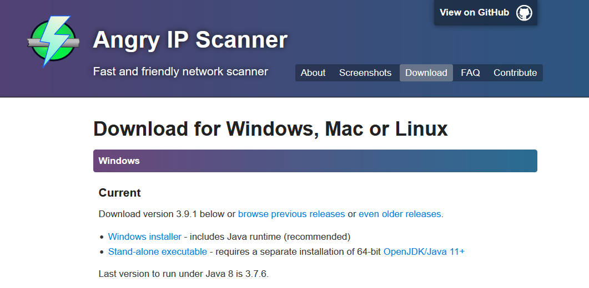
</Step>
<Step>
### Locate all files to make the SFX
Once with Angry IP Scanner downloaded and installed, we need to go to the source folder where all the program files are for it to work.
Mine is on
```shell
C:\Program Files\Angry IP Scanner\
```
</Step>
<Step>
### Making the SFX Portable .exe with Winrar
Once we are in the folder, the only thing we have to do is to select all the files, **right click** and **"Add to archive..."** and Winrar will open.
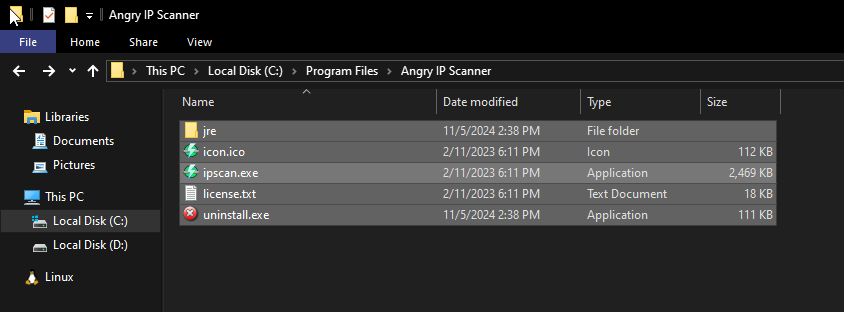
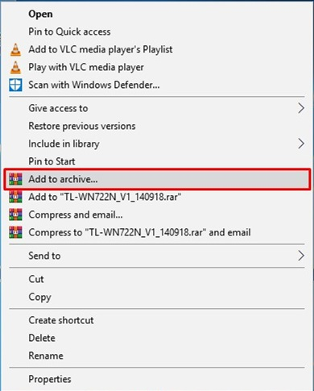
</Step>
<Step>
### In Winrar
Once Winrar is opened. The next steps are...
1. Change the name at your choice, mine will be **AngryIPScanner(Portable).exe**, and then we need to check **"Create SFX Archive"**.
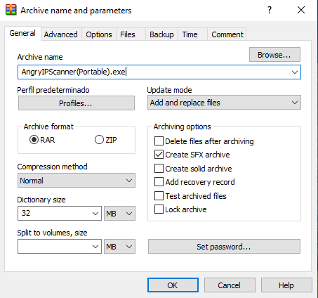
2. Next step, we need to go **"Advanced Tab"** and click on **"SFX Options"**
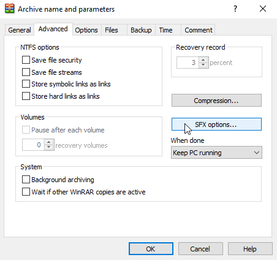
The following window opens
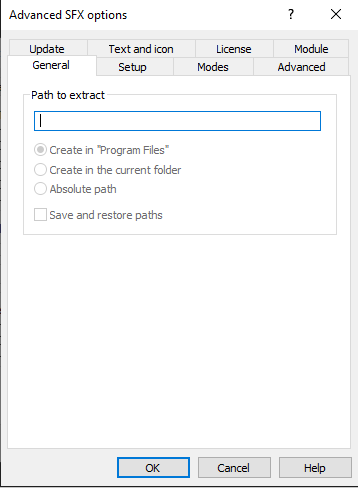
3. On the tab **"Setup"** we have to say which executable we want to run after the extraction, in our case it will be **"ipscan.exe"** which is the original .exe of Angry IP Scanner on the source folder. 
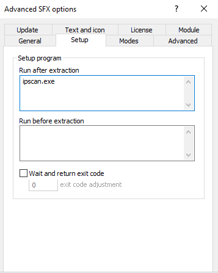
4. Next step, on the tab **"Modes"** we need to ckeck **"Unpack to temporary folder"** and in **Silent Mode** we need to choose **"Hide all"**.
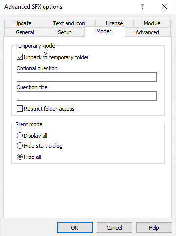
5. Check for **"Request administrative access"** on the **"Advanced"** tab.
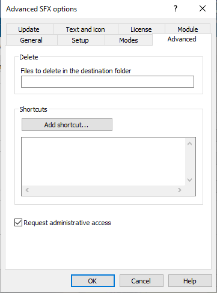
6. Then on the **"Text and icon"** tab we can put a name to the window like **"AngryIPScanner.exe"** and a custom icon **.ico** that the portable will have. In my case I will put the .ico that already comes with Angry IP Scanner.
<Callout type="info">
  If you want to put the .ico of Angry, export the .ico to another place otherwise it won't work
</Callout>
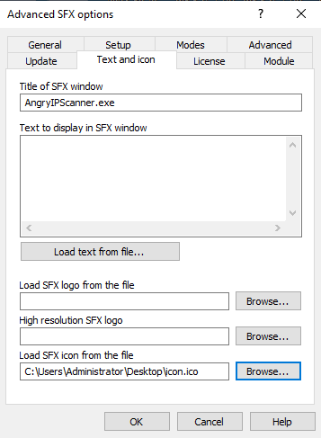
7. Then to finish click on **"OK"** and again antoher click on **"OK"**
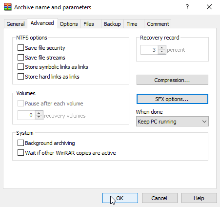
**Wait for the compression...**
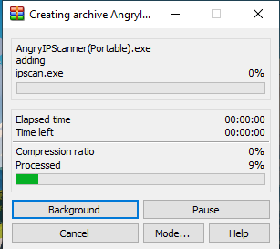
</Step>
<Step>
### Booom we have now Angry IP Scanner Portable !
Now you can have Angry IP Scanner on a USB and you have it whenever you want, you can follow this same process to make other portable tools, useful so you have a USB with portable utilities, fast and easy.
Basically what we've done is to zip all the files that Angry IP Scanner needs to run into an SFX, which is basically an executable that when executed, unzips all the files temporarily and then runs Angry IP Scanner without no installation.
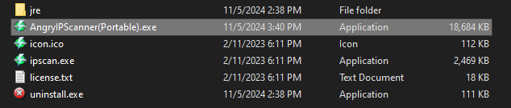
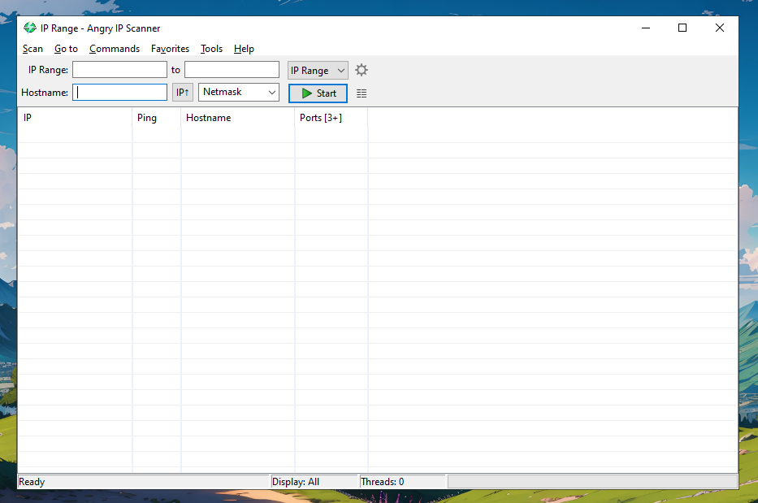
</Step>
</Steps>
For me it is quite useful, for example I made Obsidian portable for when I go to class, so I have everything in one place and without having to install anything on the class computer.
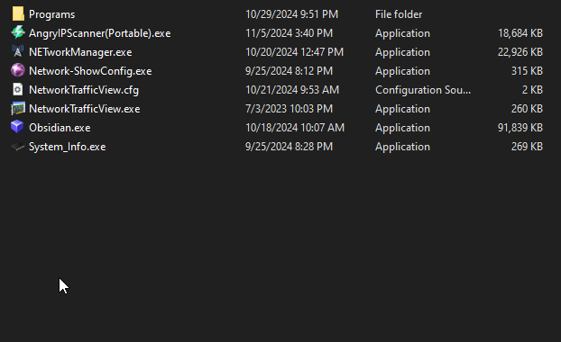
**I hope it was useful for you and that you liked it. Stay safe ! Sincerely @syztem4our666.**